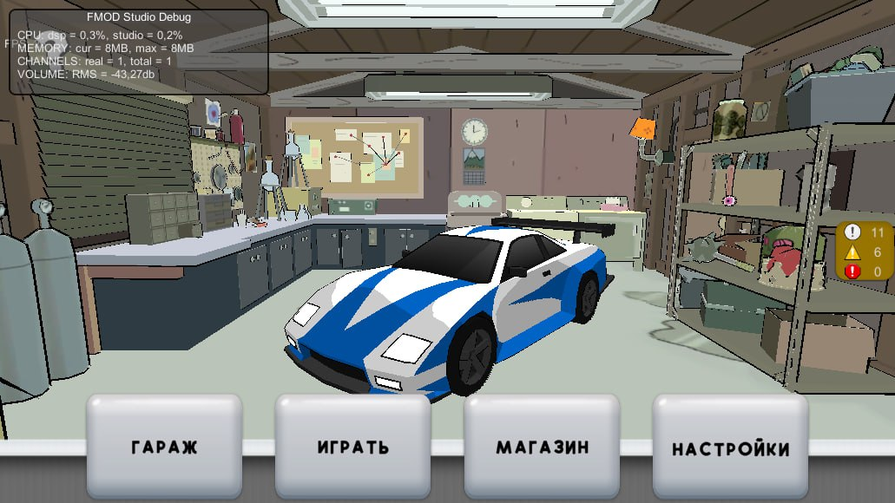
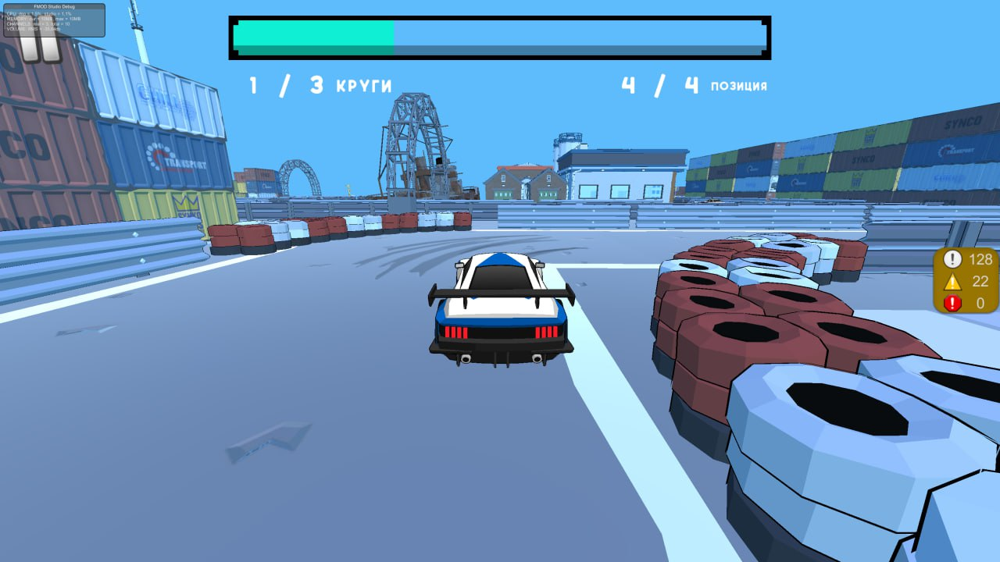
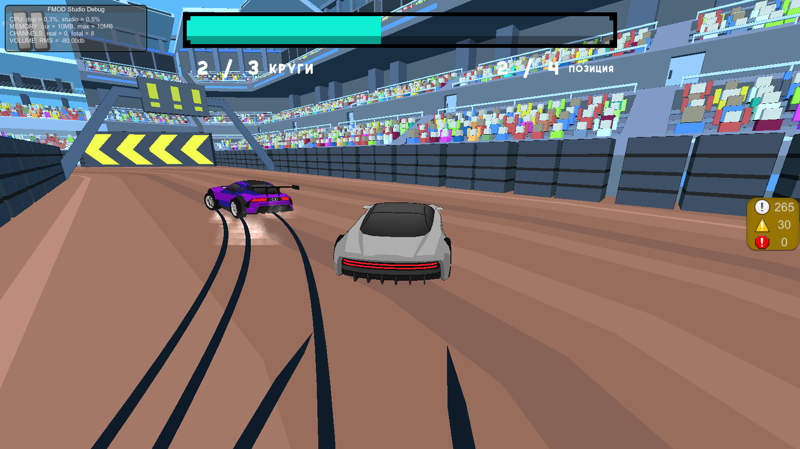

# CARTS

## О проекте

Это браузерная гоночная игра, разработанная на Unity 2022.3.9f1. В проекте используются следующие технологии и библиотеки:

- [Zenject](https://github.com/modesttree/Zenject): Для управления зависимостями и инверсией управления.
- [UniTask](https://github.com/Cysharp/UniTask): Для асинхронного программирования и управления задачами.
- [FMOD](https://www.fmod.com/): Для интеграции звуковых эффектов и музыки.

## Особенности

- Казуальное управление: быстрые повороты, набор скорости и остановка - все проходит в быстром формате.
- Красочная графика: Полностью трехмерные модели и окружение.
- Захватывающий звук: Использование FMOD для создания реалистичных звуковых эффектов и саундтрека.
- Развитый ИИ: машины ботов активно участвуют в гонке, ускоряются или замедляются относительно игрока, активно меняют траекторию движения
## Установка

1. Клонируйте репозиторий:
    
    git clone https://github.com/Frederick1122/CARTS.git
    
2. Откройте проект в Unity 2022.3.9f1.
3. Убедитесь, что все зависимости установлены (Zenject, UniTask, FMOD).

## Скриншоты

## Как играть

1. Запустите игру через Unity или соберите проект для веб-платформы.
2. Используйте клавиши стрелок для управления машиной.
3. Соревнуйтесь с другими игроками и улучшайте свои результаты.

## Вклад

Мы приветствуем вклад от сообщества! Если вы хотите помочь, пожалуйста, следуйте этим шагам:

1. Форкните репозиторий.
2. Создайте ветку для ваших изменений (git checkout -b feature-branch).
3. Внесите изменения и закоммитьте их (git commit -m 'Add some feature').
4. Запушьте изменения в вашу ветку (git push origin feature-branch).
5. Создайте пул-реквест на GitHub.

## Лицензия

Этот проект лицензирован под лицензией CC BY-NC 4.0. Подробнее см. файл [LICENSE](LICENSE).

*Happy Racing!*
